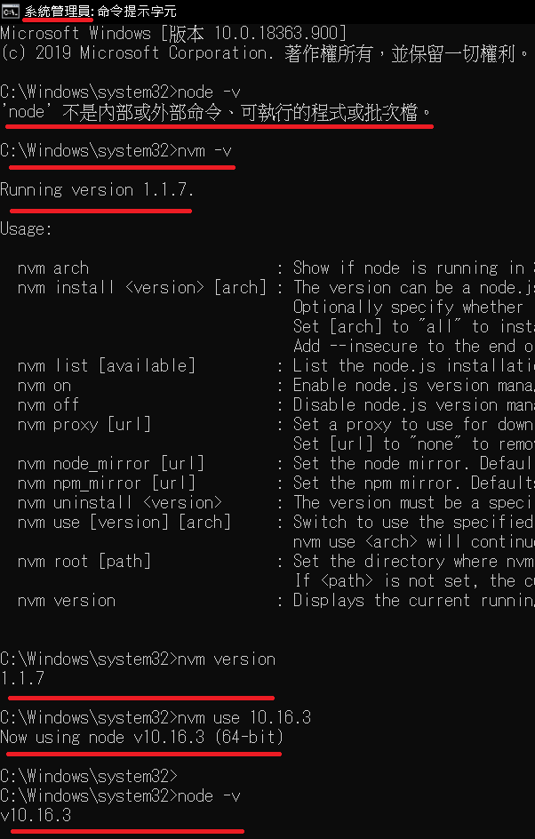

# 2020_0619_0908

今天老爸媽一早就出去玩了，所以大概晚了半小時才到公司，因為昨日順到把 ng 教學看完了，

沒想到一堂課居然要 5500 是說，確實講的有深有淺，但收到 5500 總覺得還是蠻多的，

之前是自己看線上文章好幾個人寫的內容才大致上把概念摸了一次，但直接看這個是感覺有點省到時間是沒錯...

不過還是感覺分享知識蠻賺的，感覺有點被動收入的感覺，備課兩個月，然後就大概能賺個一年左右的樣子，

等這份工作狀況 ok 後我也要來買 the big boy can code 的課來看了，

不過看他最近影片都 po 技術影片點閱率似乎都不是很好，感覺還是要 po 非技術影片，搭配技術文章才會好一點，

可能到時真的要自己搞的時候要再跟劉愷討論看看。

上午主管還沒來就先摸一下之前寫的 ng <https://github.com/johch3n611u/Side-Project-Personal-Branding-Image-Web>

Harry ,Hen , Hank ,Janet, Paul 組長名字紀錄

---

在一次嘗試專案 clone 下來後環境 init

<https://ithelp.ithome.com.tw/articles/10212118>

---

後來還是靠主管才成功初始化...

紀錄一下

首先是安裝別種版本的 node 但中間遇到了類似 `'npm' 不是內部或外部命令、可執行的程式或批次檔`

指令無法成功使用的問題

之後是利用系統開 cmd 下指令才解決

<https://ithelp.ithome.com.tw/articles/10212118>

cmd - npm i 就會依照 package-lock 進行套件安裝

中間沒出事就可以開啟專案了

再來是 vscode 小技巧 左下角有 script 的 gui 可以直接免打指令啟動

---

WANHOM ng8 公司內部系統類似 ERP 管理軟體使用 admin 1234

Portal User 軟體申請-進銷存

Sam 管理員用/ user 也會進來做盤點庫存管理

雙 db 雙後台藉由 api 互相溝通

---

備交派從多語系開始切入專案 前端後端都有

前端專案架構 pages 裡面是功能模組 module

藉由 pipe 達成多語系

利用 app router 與 URL 找元件檔案位置
