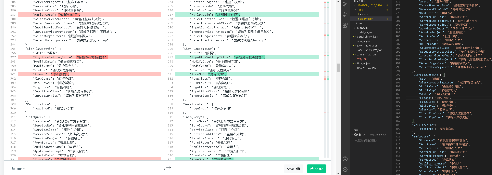
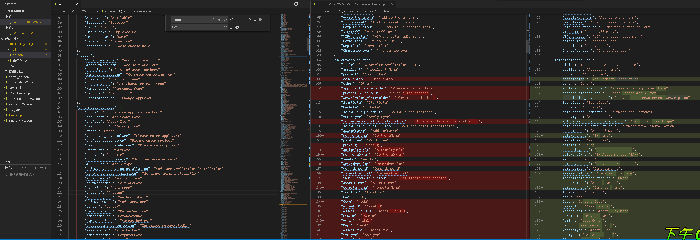
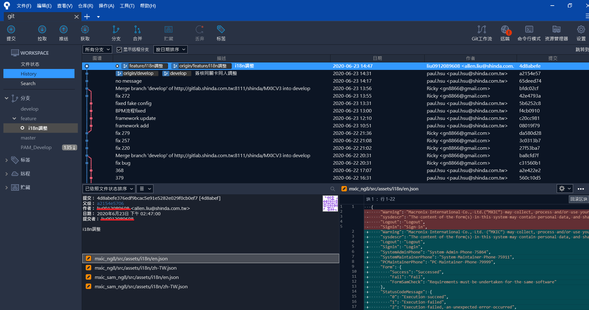

# 08:38

先測出 bug 項目，後看 Controller

## bug 項目

### 1

第一項與第二項 電腦帳號申請

員工個人帳號 / 專用帳號專人專用 / 公用帳號多人共用 / ...

AD 帳號

魏先生(部4)

附件 test.txt

* SignRepository.cs Line.873 System.NullReferenceException: '並未將物件參考設定為物件的執行個體。' nextStage 為 null。

送件異常儲存正常

### 2

帳號權限 申請項目 電腦帳號申請項目重複

#### 3

PushMail使用權限

* System.NullReferenceException: '並未將物件參考設定為物件的執行個體。'nextStage 為 null。

看來不是 BUG 可能是 PAM 之類的參數沒有帶入之類的等等再問...

## 09:48

被交代繼續處理 i18n 翻譯的雜事 QQ ?

是說這確實要有人做，因為比較雜無技術需求或許就能趕緊做好然後先看 API ?

結果版本切到 Develop 最新版本 Portal 內的 電腦資訊申請

送件變成連錯誤都不會報了... 但按下去就是沒反應

> Fetch 獲取 重整

## 12:00

原來 i18n 也眉角很多，例如 雖然 ctrl+f 查不到但不是真的沒用而是用 `<td>{{ 'BPMType.'+col.FormType|translate }}</td>` 動態方式組出，

那感覺應該是有應對的開發方式，不然這樣不就要花一個人工人力來專門做這件事 ?!





搭配 CTRL+G 切行

## 02:29

還是太菜了聽到 keyword 以為再說我，結果就加緊把東西弄好就給過去了，沒自己留點時間看點東西...

## 02:57

熟悉 git 協調作業 開分支調整 i18n 用 source tree



前端追資料真的很麻煩 ， input 是從 模板指令注入的所以可以查 模板指令關鍵字 去查從哪注入進來的

接著標記查動態 i18n 加緊時間 有機會再接續看 controller

## 03:45

暫時完成，感覺也沒加到啥技術力，接著留個幾分鐘來看 controller

## 04:00

看到一半才發現剛剛更的版本有錯誤... 直接被主管贓到 = = ... 真的是太不專心了

## 05:36

發現錯的很多東西，且同時

聽同事討論專案的部分，線上會議，不知道對方是不是客戶還是顧問，口氣感覺超... 整個都用罵的，不知道在高幾點的，不知道為啥工程師會需要對接客戶，且如果是那間四千人的公司難怪口氣那麼大?...

## 05:52

原來虛驚一場，並沒有增加很多 i18n 的 key ， 然後也更了解要怎樣團體合作利用 gitflow


步驟 1.切換至 feature i18n 調整  2.要推分支前先 合併 develop 至當前分支 3.發現有問題改完再繼續合併一次再推 重複類推

---

## MxicApiHostController.cs

<details>
  <summary>Controller</summary>

```C#
using Mxic.Framework.Core;
using Mxic.Framework.ServerComponent;
using Mxic.Framework.Web.WebApiHostBase;
using Mxic.ITC.Portal.API.App_Start;
using Newtonsoft.Json;
using System;
using System.Collections.Concurrent;
using System.Collections.Generic;
using System.ComponentModel.DataAnnotations;
using System.Configuration;
using System.IO;
using System.Linq;
using System.Net;
using System.Net.Http;
using System.Net.Http.Headers;
using System.Reflection;
using System.Text;
using System.Threading;
using System.Threading.Tasks;
using System.Web;
using System.Web.Http;
using System.Web.Http.Controllers;
using System.Web.Http.Cors;
using System.Web.Http.Filters;
using System.Web.Mvc;

namespace Mxic.ITC.Portal.API.Controllers
{
    /// <summary>
    /// Mxic 的 Web PI Service Layer 主要入口
    /// 注意：請不要任意修改 Api Controller 的名稱，若真需要修改，請連同 App_Start 下的 WebApiConfig.cs 中的 Route 設定一起修改。
    /// </summary>
    [EnableCors(origins: "*", headers: "*", methods: "*")]
    public class MxicApiHostController : ApiHostBase
    {
        private static ConcurrentDictionary<string, Assembly> _dllMap = new ConcurrentDictionary<string, Assembly>(System.StringComparer.OrdinalIgnoreCase);
        public override Task<HttpResponseMessage> ExecuteAsync(HttpControllerContext controllerContext, CancellationToken cancellationToken)
        {
            string fileName = controllerContext.RouteData.Values["fileName"].ToString();
            string className = controllerContext.RouteData.Values["className"].ToString();
            string nameSpaceName = controllerContext.RouteData.Values["nameSpaceName"].ToString();
            string methodName = controllerContext.RouteData.Values["methodName"].ToString();

            string appPath = string.Empty;

            bool result = true;

            if (System.Diagnostics.Debugger.IsAttached)
            {
                try
                {
                    appPath = HttpRuntime.AppDomainAppPath;
                }
                catch
                {
                    appPath = Environment.CurrentDirectory;
                    result = false;
                }
            }
            else
            {
                appPath = HttpRuntime.AppDomainAppPath;
            }

            string dllPath = "";

            if (result)
            {
                dllPath = "bin/" + fileName + ".dll";
            }
            else
            {
                // 此路徑為project/bin/debug
                dllPath = "/" + fileName + ".dll";
            }

            // fileName, string nameSpaceName, string className, string methodName
            Assembly ass = _dllMap.GetOrAdd(fileName, name => LoadAssembly(name, appPath + dllPath));
            Type magicType = ass.GetType(nameSpaceName + "." + className);
            ParameterInfo ParamInfo = null;
            MethodInfo magicMethod = magicType.GetMethod(methodName);
            ParamInfo = magicMethod.GetParameters().FirstOrDefault();

            object InvokeObj = null;
            object parameter = GetParameter();
            if (ParamInfo != null)
            {

                switch (ParamInfo.ParameterType.ToString())
                {
                    case "System.Int16":
                    case "System.Int32":
                    case "System.Single":
                    case "System.DateTime":
                    case "System.Double":
                    case "System.Decimal":
                    case "System.Boolean":
                    case "System.String":
                    case "System.Byte[]":
                        break;

                    default:    //如果都不是以上的物件，才進行 JSON DeserializeObject.
                                //parameter = "{\"PageSize\":20,\"PageNum\":1,\"Logger\":\"\",\"StartDate\":\"\",\"EndDate\":\"\",\"LogObject\":{\"SystemName\":null,\"DBServer\":null,\"DBName\":\"DB2\",\"FromName\":null,\"RecordOwnder\":null,\"AccessBy\":null,\"RecordId\":null}}";
                        InvokeObj = JsonConvert.DeserializeObject(parameter.ToString(), ParamInfo.ParameterType);
                        break;
                }

                #region DataAnnotations Validation
                /*如果 InvokeObj 有 NoValidation 這個 Property 且為 true 則不進行驗證*/
                var noValidation = Convert.ToBoolean(InvokeObj?.GetType()?.GetProperty("NoValidation")?.GetValue(InvokeObj));
                if (!noValidation)
                {
                    var langCode = controllerContext.Request.Headers.AcceptLanguage.FirstOrDefault()?.Value;
                    if (InvokeObj != null)
                    {
                        var context = new ValidationContext(InvokeObj);
                        var results = new List<ValidationResult>();
                        var isValid = Validator.TryValidateObject(InvokeObj, context, results,true);

                        var sb = new StringBuilder();
                        if (!isValid)
                        {
                            foreach (var validationResult in results)
                            {
                                sb.AppendLine(validationResult.ErrorMessage.Translate(langCode));
                            }
                            //throw new ValidationException(sb.ToString());
                            HttpResponseMessage response = new HttpResponseMessage();
                            response.StatusCode = HttpStatusCode.NotAcceptable;
                            response.Content = new StringContent(sb.ToString());
                            response.Headers.Add("Access-Control-Allow-Origin", "*");
                            throw new HttpResponseException(response);

                        }
                    }
                }
                #endregion

            }
            return base.ExecuteAsync(controllerContext, cancellationToken);
        }
        private Assembly LoadAssembly(string dllName, string dllPath)
        {
            var assembly = AppDomain.CurrentDomain.GetAssemblies().FirstOrDefault(s => string.Equals(s.GetName().Name, dllName, StringComparison.OrdinalIgnoreCase));
            if (assembly != null) return assembly;

            try
            {
                assembly = Assembly.LoadFrom(dllPath);
            }
            catch
            {
                assembly = Assembly.LoadFile(dllPath);
            }

            return assembly;
        }

        private object GetParameter()
        {
            object inputParams = null;

            if (HttpContext.Current.Request.Headers["Content-Type"].IndexOf("application/json") >= 0
                || HttpContext.Current.Request.Headers["Content-Type"].IndexOf("text/plain") >= 0)
            {
                HttpContext.Current.Request.InputStream.Position = 0;
                var tempStream = new MemoryStream((int)HttpContext.Current.Request.InputStream.Length);

                HttpContext.Current.Request.InputStream.CopyTo(tempStream);
                tempStream.Position = 0;
                using (var sr = new StreamReader(tempStream))
                    inputParams = sr.ReadToEnd();

                HttpContext.Current.Request.InputStream.Position = 0;
            }
            else
            {
                inputParams = HttpContext.Current.Request.InputStream;
            }

            return inputParams;
        }
    }

}
```

</details>

[EnableCors](https://www.google.com/search?q=EnableCors&rlz=1C1CHBF_zh-TWTW905TW905&oq=EnableCors&aqs=chrome..69i57j0l7.600j0j7&sourceid=chrome&ie=UTF-8) 在ASP.NET Web API 2 中啟用跨原始來源要求

[ConcurrentDictionary](https://blog.darkthread.net/blog/concurrentdictionary/) 代表索引鍵/值組的安全執行緒集合，此集合可由多個執行緒並行存取。

類似可以同時多方調用 ?

`Assembly` 表示此組件是可重複使用、可控制版本和自我描述的 [Common Language Runtime](https://zh.wikipedia.org/wiki/%E9%80%9A%E7%94%A8%E8%AA%9E%E8%A8%80%E9%81%8B%E8%A1%8C%E5%BA%AB) 應用程式建置區塊。

`ExecuteAsync` 當 IHostedService 啟動時，會呼叫此方法。 此實作應傳回工作，以表示所執行長時間執行作業的存留期。

`Task` 表示非同步作業。

`HttpControllerContext` 包含有關單個HTTP操作的信息。

`CancellationToken` [取消權杖的輕量級物件，某些時候 ，建立權杖的物件可以使用它來要求作業停止活動。](https://docs.microsoft.com/zh-tw/dotnet/standard/threading/cancellation-in-managed-threads)

`string.Empty` = ""; <https://jasper-it.blogspot.com/2014/08/c-string-stringempty-is-more-efficient.html>

`System.Diagnostics.Debugger.IsAttached` 取得值，表示偵錯工具是否附加至處理序。

`HttpRuntime.AppDomainAppPath` 回傳應用程式實體目錄位置。

`Environment.CurrentDirectory` 取得目前設定的目錄位置。

`Assembly.GetOrAdd()` 如果索引鍵不存在，則將索引鍵/值組加入 ConcurrentDictionary<TKey,TValue>。 傳回新的值，若索引鍵已存在，則傳回現有的值。

`AppDomain.CurrentDomain.GetAssemblies()` 取得已載入至這個應用程式定義域之執行內容的組件。

`Assembly.LoadFrom()` 載入組件。

`Assembly.LoadFile()` 載入組件檔案的內容。

`Type` 代表類型宣告：類別類型、介面類型、陣列類型、值類型、列舉類型、類型參數、泛型類型定義，以及開放式或封閉式的建構泛型類型。

`ParameterInfo` 探索參數的屬性並提供參數中繼資料的存取。

`MethodInfo` 探索方法的屬性 (Attribute) 並提供方法中繼資料 (Metadata) 的存取。

`Controller.getParameter()` 是获取POST/GET传递的参数值

`GetParameter()` 抓取 header 封包參數，看起來是要做檔案上傳抓取。針對 httpcontent 的一些 stream 操作。抓取到的 json 接著去反序列化轉為物件

---

目前看到這邊應該是把 API 框架要做的事情居然在這手動做不知道為何要這樣

接著手動驗證 參數

進行 DataAnnotations Validation 塞入 Access-Control-Allow-Origin CORS 的手工版