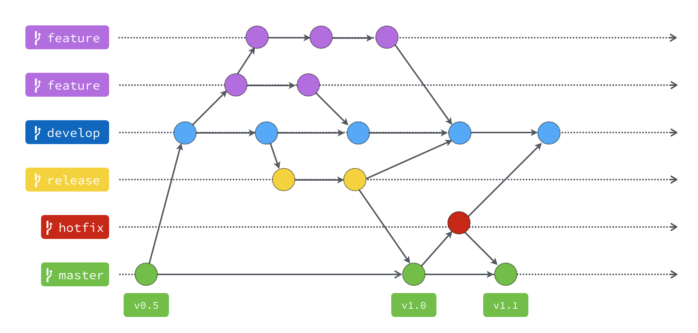

# 2020_0615

開華泰銀行、熟悉辦公環境

DBRever -> Oracle

node.js

1. nvm for windows
2. ctrl+p > nvm version 確認 nvm 是否有安裝成功
3. nvm ls 目前 local 所有 Node.js 版本
4. nvm ls-remote 列出所有 Remote 的 Node.js 版本 (不知道為何沒作用，可能因為 nvm 是新版的有改了什麼)
5. nvm install latest 14.4.0
6. nvm alias default [version] 指令以後預設啟用的 Node.js 版本
7. nvm use [version] 使用 [version] 版本，但不更改預設啟用的版本

原本想嘗試 yarn 但怕有些 package 會不支援就先緩緩。

Gmail x3123456 * 2 fstX uppercase allen.liu AD 192.168.0.131 47 165

以前沒試過彈性工時，感覺真的蠻彈性的，就不會有遲到或太趕的問題，9 - 6、8 - 10

申請流程 請假單

Gitlab Uname liu091 email allen.lin psd x3123456

winbase no ssl

gitflow feature -> develop

接手專案 Router 較複雜 內部 framework nuget DI 環境 fake 開發用資料存取

期望 Dropbox -> 程式 -> localDB

一些命名通則就參考這個

<https://docs.microsoft.com/zh-tw/dotnet/standard/design-guidelines/naming-guidelines>

SourceTree

pageantkey list

LinQpad

## C# W3C

構造函數(建構式)的優點是，在創建類的對象時會調用它。可用於設置字段的初始值

static 不需 new 即可訪問 且變數為共用全域

<https://dotblogs.com.tw/im_sqz777/2017/11/14/235408>

建構式 與 類名需匹配 且無返回值

默認情況下，所有類都具有構造函數：如果您自己沒有創建類構造函數，則 C＃ 為您創建一個。但是，您將無法設置字段的初始值

構造函數非常有用，因為它們有助於減少代碼量

<https://www.w3schools.com/cs/cs_constructors.asp>

private 訪問修飾符聲明字段，則只能在同一類中對其進行訪問

使用修飾符實現“ 封裝 ”，即確保對用戶隱藏“敏感”數據的過程。

屬性就像變量和方法的組合，它具有兩個方法： get 和 set 方法：

<https://www.w3schools.com/cs/showjava_classes.asp?filename=demo_properties>

自動屬性 <https://www.w3schools.com/cs/showjava_classes.asp?filename=demo_properties_auto>

屬性更好地控制成員（減少您自己（或其他人）弄亂代碼的可能性）

字段可以設置為只讀（如果僅使用該 get 方法）或僅寫（如果僅使用該 set 方法）

靈活：程序員可以更改代碼的一部分而不影響其他部分 增強數據安全性

要從類繼承，請使用 : 符號 <https://www.w3schools.com/cs/showjava_classes3.asp?filename=demo_inheritance>

為什麼以及何時使用“繼承”？-這對於代碼可重用性很有用：創建新類時，重用現有類的字段和方法。

如果您不希望其他類繼承自一個類，請使用 sealed 關鍵字

嘗試繼承一個 sealed 類，C＃將生成一個錯誤

多型 (Polymorphism)

C＃ 提供了一個覆蓋基類方法的選項，方法是將 virtual 關鍵字添加到基類內部的方法，並 override 為每個派生類方法使用關鍵字

<https://www.w3schools.com/cs/showjava.asp?filename=demo_polymorphism2>

數據抽像是隱藏某些細節並僅向用戶顯示基本信息的過程。可以使用抽像類或 接口來實現抽象

abstract 關鍵字用於類和方法

是一個不能用於創建對象的受限類（要訪問它，必須從另一個類繼承

只能在抽像類中使用，並且沒有主體。主體由派生的類提供（繼承自

<https://www.w3schools.com/cs/showjava.asp?filename=demo_abstract>

在 C＃ 中實現抽象的另一種方法是使用接口。

interface 是一個完全“ 抽像類 ”，只能包含抽象方法和屬性（帶有空主體）

在界面的開頭以字母 “ I ” 開頭被認為是一種好習慣，因為它使您自己和其他人更容易記住它是界面而不是類。

* 與抽像類一樣，接口不能用於創建對象（在上面的示例中，無法在 Program 類中創建“ IAnimal ”對象）
* 接口方法沒有主體-主體由“實現”類提供
* 在實現接口時，必須重寫其所有方法
* 接口可以包含屬性和方法，但不能包含字段/變量
* 接口成員都默認 abstract 和 public
* 接口不能包含構造函數（因為它不能用於創建對象）

C＃ 不支持“多重繼承”（一個類只能從一個基類繼承）。但是，這可以通過接口來實現，因為該類可以實現多個接口。 注意：要實現多個接口，請用逗號將它們分開（請參見下面的示例）

<https://www.w3schools.com/cs/showjava.asp?filename=demo_interface_multiple>

enum 是代表一組常量（不可更改/只讀變量）的特殊“類” 。

enum 可以在一個類的內部

默認情況下，枚舉的第一項的值為0。第二項的值為1，依此類推。

要從項目中獲取整數值，必須將項目顯式轉換為 int

也可以分配自己的枚舉值

switch 語句中經常使用枚舉來檢查相應的值

當您知道自己不會更改的值（例如月日，天數，顏色，紙牌組等）時，請使用枚舉。

file <https://www.w3schools.com/cs/cs_files.asp>

try catch <https://www.w3schools.com/cs/cs_exceptions.asp>

## 參考

<https://gitbook.tw/chapters/gitflow/why-need-git-flow.html>

<https://ithelp.ithome.com.tw/articles/10184980>

<https://blog.goodjack.tw/2018/03/visual-studio-code-extensions.html#markdown-%E7%9B%B8%E9%97%9C>